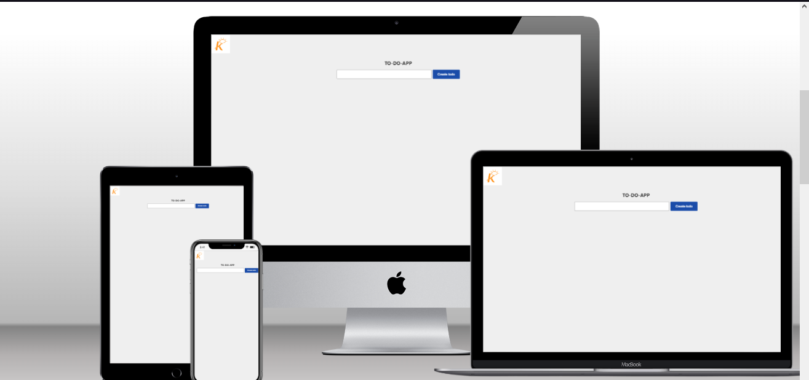

# KrugerStar Playground

> Primer proyecto Primer proyecto Primer proyecto Primer proyecto Primer proyecto Primer proyecto Primer proyecto Primer proyecto

##Buil with

-JavaScript
-React.js 18
-Netlify
-HTML+CSS

## Live Demo

[live demo link](https://todo-app-kruger.netlify.app)

## Run it locally

### Setup

-Clone this repo using `git clone https://github.com/DashCode47/todoapp de su proyecto`

### Commands

-`npm i` -`npm star`

## Author

👤 **David Lozada**

- GitHub: [@Juanse7793](https://github.com/DashCode47)
- Twitter: [@Juanse77930](https://twitter.com/dash47)
- LinkedIn: [Juan Sebastian Sotomayor](https://linkedin.com/in/david-lozada47)
  px"

## 🤝 Contributing

-Juan Sotomayor-Tutor Kruger Star

## Show your support

Give a ⭐ if you like this project!

## Acknowledgments

- Designed by JS

This project is [MIT](./MIT.md) licensed.
